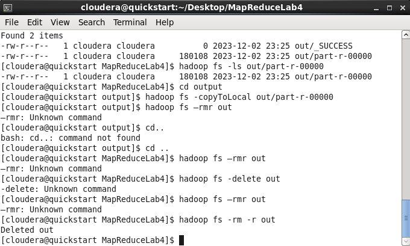

## 写在前面

行了知道你又成为了ddl战士（

这个文档是**辅助速通攻略**但不是完全的宝宝教程，截取了大部分本人自己完成lab的时候的问题，但不是全流程！！！！（而且里面还包含了本人一些踩坑问题和弯路，我并没有完全删除）请结合lab sheet食用。

公主请做lab XD~

## 环境配置

首先大家电脑上应该已经安装好了vmware(如果之前经历过大数据课程的洗礼)，这一步不多讲了，csdn上的教程很多。

接下来按照lab sheet中的指导下载Cloudera Quickstart VM,下载结果是个安装包，下载好了解压。差不多如下：

打开vmware，点击左上角打开虚拟机，选择刚才的文件夹中最后应该有一个vmx文件，直接选中，开启虚拟机即可。有网上的帖子说需要配置8G memory，我是配了8G 4 core。

接下来第一步完成了，等待一段时间，cloudera开启。

### 正常情况下下面的ant安装不用看了因为老师发的环境里已经配好了

我到profile里才发现已经下好了气气气

当然如果你发现没有ant的话可以参考一下这个安装教程

点开上方地球标志进入浏览器，输入ant的网站地址(lab sheet有)，我这里下载的是1.9.16版本的tar文件，一般来说他会下载到cloudera/Downloads/文件路径下，打开终端进入该文件夹，输入`tar -zxvf apache-ant-1.9.16-bin.tar.gz -C ./`，显示解压成功。

如果显示没有权限可以进入root模式，终端中输入` sudo passwd root `（注意passwd的拼写），再输入用户密码，接下来会让你设置root密码，并再次确认。 接下来输入su，再输入刚刚设置的root密码就可以进入root了。

总之目前我的ant所在目录是

在终端中输入`pwd`可以查看当前目录。

接下来配置环境变量，一般来说进入root模式之后就可以操作profile文件了，如果是普通用户模式应该会显示没有权限。

记录：我的root密码是123456

### 利用ant配置文件（正常流程接着从这里看）

这个ant的作用和makefile差不多，不同的是ant是在centos平台用的，利用`ant -buildfile xml路径`的指令就可以把实验需要的文件jar包获取，接下来我进行详细操作，做完这个步骤就刚好和老师的视频接轨了。

cloudera中的ant已经下载好了，在如下文件夹路径

在桌面创建项目文件夹，就是你lab4的文件夹，然后把qmplus上的xml文件（Ant Build那个）复制到cloudera虚拟机上

可以先创建一个txt文件，再进入properties修改后缀，总之你在这个文件里有一个build.xml文件（其他的文件是我探索中添加的现在不用管）

在这个Lab4文件夹里创建一个src文件（这个后面eclipse创建项目要用）

现在打开终端，进入build.xml文件所在的目录，输入刚才说的指令`ant -buildfile build.xml`：

如果build成功，会有如下显示：

如果失败，会显示`BUILD FAILED`，failed原因一般会打印出来可以自己检查，按照我刚才的步骤一般来说应该没有什么问题。

现在他在Lab4文件夹里生成了classes，dist 文件。老师的视频里还有一个inputfile.txt文件，我图片里的文件其实是应该到后面hdfs的部分再用的，现在不影响什么，不弄也行。

检查一下dist文件，里面已经有了WordCount.jar文件，现在和老师视频对应上了。（这一步只是一个小demo，这个jar包后面做完项目会重新生成的当前这个不用管）

over

## Coding

老师给的labsheet里提到了本次可以使用Eclipse/gedit进行java代码的编写，我之前是一个不折不扣的idea选手（悲），这个gedit就是个文本编辑器，感觉和txt没什么区别，不是很想用，所以还是用eclipse吧。（re：其实老师后面给了代码，所以两个都可以，甚至gedit更简单，推荐用gedit的）

### hdfs命令搭建环境

First, let’s have a look at what is currently available in  HDFS: You can browse the contents of a remote HDFS folder through the **hadoop fs –ls** command, which is similar to the Unix listing command. If you specify no parameters you will check your empty home holder.

You can check the root folder of HDFS by running  **hadoop fs -ls /**

For our lab we will need to copy the input file into our HDFS folder. First, we need to create a new folder in our HDFS personal space to store the input data. That operation can be performed with the –mkdir option:

 **hadoop fs –mkdir input**

If you browse the contents of your folder you should now see the newly created folder. Remember, you can see the files/folders in HDFS using the following command: **hadoop fs -ls**

The input for this job is going to be a small file (*[sherlock.txt](https://qmplus.qmul.ac.uk/mod/resource/view.php?id=1480094)*). This text file collects several of the works of Arthur Conan Doyle (as packaged by Project Gutenberg). You can download this from QMPlus. When you download it, it will be in your local filesystem - **not in HDFS**. Hence, we must copy the text file to the HDFS. File transfer from a local filesystem to Hadoop is perform using the **–copyFromLocal** command:

Go in your Terminal, and move to the folder where you downloaded the sherlock.txt file. Then run the follslowing command:

**hadoop fs -copyFromLocal sherlock.txt input**

This will upload the sherlock.txt file into the input folder you just created on HDFS. If you now check the contents of the input folder in HDFS you should see the file appearing. This can be done with the following command:

**hadoop fs -ls input**

This has therefore copied the file from your local filesystem into HDFS. It now becomes available for use by Hadoop - remember, Hadoop can **only** read and write files in HDFS!

###  task1

In Map/Reduce we will write three parts of the programme: The **Mappe**r, which implements the Map function, the **Reducer**, which implements the Reduce function, and the **main class** that configures the complete job. 

The input and output of both the Map and the Reduce function is a tuple of key and value. 

PPT中的是伪代码，需要改一下。java需要写以上三个部分，其实老师已经在labsheet中给好了，其中有一个需要自己填一点点代码。

In this first lab we will use the `IntWritable` object, which stores ==an int, and the Text object, which stores a String==. In Hadoop whenever reading or writing data, we also use these special classes for representing data types. The provided source code will show how to initialise and use these objects. 

三个代码完成后开始进行执行

The code of your MapReduce project is complete. In order to create a package ready to be executed by Hadoop go to the project ==root folder== and invoke the ant command: **ant clean dist**他这里会再生成一个dist里的wordcount.jar，不知道替没替换原来的，所以之前建议直接删掉。

If the code compiles correctly a compressed jar file named HadoopTest.jar（这里看你自己命名了我的是wordcount） will appear in a newly created dist/ folder. If there are errors, you will see BUILD FAILED. Go through each compile-time error and try to fix them in your code.

Finally, execute the job from the **base folder** of your project (where build.xml is) running the following line:运行试试

**hadoop jar dist/WordCount.jar WordCount input out** 

失败1：情况是这样的，我是光复制了代码没保存所以报错，记得需要在eclipse里ctrl+s一下

保存了之后继续报错2

显示连接不上server，查了查原因是防火墙没关。检查下防火墙关了，但是还是失败

尝试重启……希望能成功QAQ

重启后成功了，我猜测可能是我中间挂了一会儿梯子，然后梯子的地址就污染了主机和虚拟机的通讯，导致失败。如果有相同问题的宝宝可以试试先把虚拟机挂起，然后主机翻墙，翻回来，再继续运行虚拟机。

done！

检查一下hdfs上有没有输出的结果。Finally, if the job has executed correctly there should be two files in the out folder in the **HDFS** (not your local filesystem). Only the part-XXXX files contain the output of Reducers. _SUCCESS is empty.`hadoop fs -ls out`

然后把hdfs上的output放回本地

hadoop fs –copyToLocal <hdfsfile> <localdestination>

其实就是在你本地要output的文件夹里敲`hadoop fs -copyToLocal out/part-r-00000`

到此老师的视频讲解结束

把结果放本地之后删除hdfs的out文件夹

After retrieving the output you can remove the output folder through the –rmr fs command. If the designated output folder was out, you can remove it by doing:

`hadoop fs –rmr out`

报错1: Unknown command

使用了delete仍然显示不存在，继续排查……

试试`hadoop fs -rm -r out`，成功了。

part 1 done!

### Task 2

这里lab sheet中明显老师想让我们根据上面的内容独立进行多个mapper的操作。

首先在qmplus上下载**[onehundredM.txt](https://qmplus.qmul.ac.uk/mod/resource/view.php?id=1480095)** 。

1.把这个file copy到HDFS 上，叫做`gutenberg`。

1. 首先看一下hdfs上目前有什么

	`hadoop fs -ls /`

			

2. 然后新建一个gutenberg文件夹

	`hadoop fs -mkdir gutenberg`

​	查看文件方法`hadoop fs -ls`。

​	删除文件的方法 `hadoop fs -rm -r 文件名`			

3. 然后把新的电子书传到hdfs上。`hadoop fs -copyFromLocal onehundredM.txt gutenberg`

4. 总之目前目标情况就是 gutenberg里有个ouehundredM.txt

	

2.之后需要对第一步的java项目进行一个修改

1. Now modify your previous Map/Reduce job by editing the **WordCount.java** file. Add the following line in the main method in order to use two reducers instead of one.

	**job.setNumReduceTasks(2);**

	This new line will tell Hadoop to run **two** reduce tasks. This is not necessary with small amounts of data, but imagine that you had 100GB. 

​		具体的修改结果需要自己完成，诚信问题无法更多的讲解。

2. 修改完WordCount.java了之后需要再次进行文件打包运行，我觉得之前的jar包被自动替换了，不用删。

	在你的目录文件夹里运行`ant clean dist` `hadoop jar dist/WordCount.jar WordCount gutenberg out2`

​		

​		

3.把hdfs上的结果下回本地

1. 在你想接收的文件夹里输入`hadoop fs -getmerge out2 count.txt`

2. 检查一下

	

Done！

### Task 3

这个会更加复杂一点，让自己写mapper和reducer。主要任务是找每个单词长度对应多少不同的单词。

格式如下：

1: 20
2: 300
3: 50000
…

99:1

为了执行此任务，您需要在初始数据集上连续运行2个MapReduce作业。幸运的是，您已经运行了第2部分中的第一个MapReduce作业。因此，我们只需要编写第二MapReduce作业。因此，此作业的**输入**数据将是第2部分中以前WordCount代码的**输出**数据（即**out2**文件夹中）。这很有帮助，因为WordCount作业已经创建了一个唯一的单词列表。我们只需要通读单词并计算它们的长度。

count.txt输出格式类似如下：

说思路：仿照之前写三个类，但是main函数的类老师给了，在labsheet里，所以只需要写mapper和reducer类就行。

1. 先说TokenToLengthMapper.java：

	主要逻辑：

	* 根据‘\t’进行分割，取每次分割的第一个值，注意input格式是 <Object, Text>
	* 输出的值是<IntWritable, IntWritable>，前面的代表单词长度，用**component[0].length()**得到，后面的是value值

2. 再说IntSumReducer.java ，这个类和之前的差不多。注意input<IntWritable, IntWritable> ，output<IntWritable, IntWritable>就行

3. WordLengthCount.java老师给了直接粘贴就行。

注意按照labsheet修改build.xml里面的名称。

之后就是在word_length里运行：

`ant clean dist`

`hadoop jar dist/WordLengthCount.jar WordLengthCount out2 out3`注意这里面已经说明out2的内容是输入了，之前的类根本不用管这个输入。

Done！
